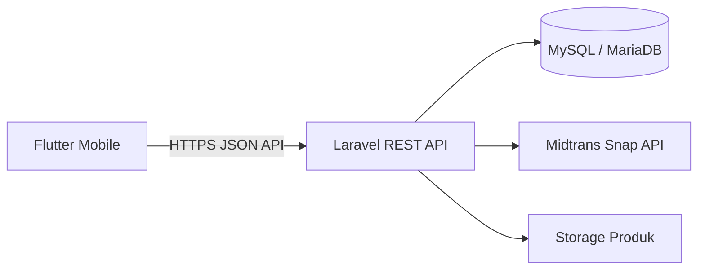
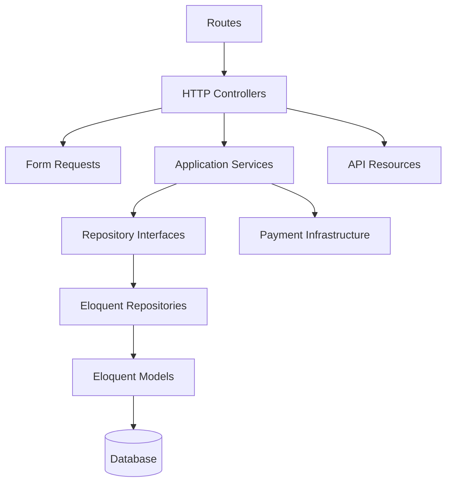
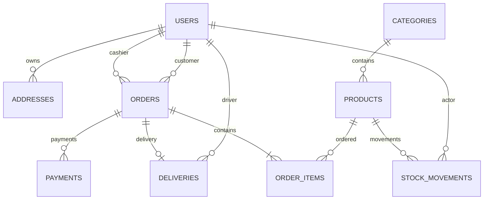
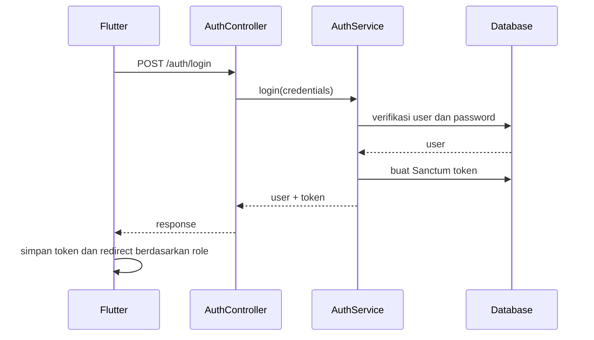
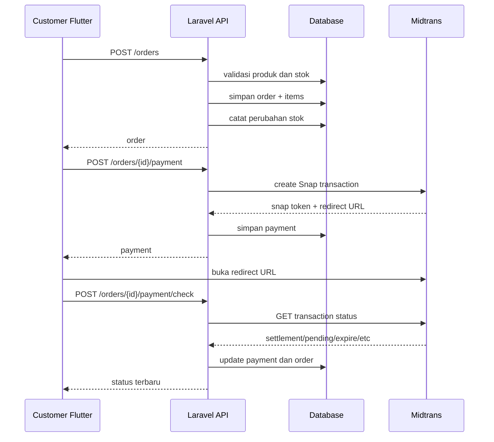

# Dokumentasi Backend Kanzza Frozen Food

> **Nama sistem:** Kanzza Frozen Food Sales & Delivery API
> **Jenis aplikasi:** REST API untuk aplikasi mobile Flutter
> **Framework:** Laravel 13
> **Autentikasi:** Laravel Sanctum
> **Database:** MySQL/MariaDB
> **Payment gateway:** Midtrans Snap
> **Base URL produksi:** `https://kanza.djncloud.my.id/api/v1`
> **Repository:** `arhan321/kanzza_backend`

---

## Daftar Isi

1. [Gambaran Umum](#1-gambaran-umum)
2. [Tujuan Backend](#2-tujuan-backend)
3. [Aktor dan Hak Akses](#3-aktor-dan-hak-akses)
4. [Teknologi](#4-teknologi)
5. [Arsitektur Sistem](#5-arsitektur-sistem)
6. [Struktur Folder](#6-struktur-folder)
7. [Persyaratan Sistem](#7-persyaratan-sistem)
8. [Instalasi dengan Docker](#8-instalasi-dengan-docker)
9. [Instalasi Tanpa Docker](#9-instalasi-tanpa-docker)
10. [Konfigurasi Environment](#10-konfigurasi-environment)
11. [Konfigurasi Midtrans](#11-konfigurasi-midtrans)
12. [Konfigurasi Ongkos Kirim](#12-konfigurasi-ongkos-kirim)
13. [Konfigurasi Database](#13-konfigurasi-database)
14. [Struktur dan Relasi Database](#14-struktur-dan-relasi-database)
15. [Enum dan Status Sistem](#15-enum-dan-status-sistem)
16. [Standar Format Respons API](#16-standar-format-respons-api)
17. [Autentikasi dan Token](#17-autentikasi-dan-token)
18. [Role Middleware](#18-role-middleware)
19. [Dokumentasi Endpoint](#19-dokumentasi-endpoint)
20. [Alur Bisnis Utama](#20-alur-bisnis-utama)
21. [Pengelolaan Stok](#21-pengelolaan-stok)
22. [Pembayaran Midtrans Tanpa Webhook](#22-pembayaran-midtrans-tanpa-webhook)
23. [Seeder dan Akun Pengujian](#23-seeder-dan-akun-pengujian)
24. [Pengujian API](#24-pengujian-api)
25. [Deployment Produksi](#25-deployment-produksi)
26. [Keamanan](#26-keamanan)
27. [Logging dan Monitoring](#27-logging-dan-monitoring)
28. [Backup dan Restore](#28-backup-dan-restore)
29. [Troubleshooting](#29-troubleshooting)
30. [Keterbatasan Saat Ini](#30-keterbatasan-saat-ini)
31. [Checklist Final Backend](#31-checklist-final-backend)
32. [Panduan Pengembangan Lanjutan](#32-panduan-pengembangan-lanjutan)

---

# 1. Gambaran Umum

Backend Kanzza Frozen Food merupakan layanan REST API yang menjadi pusat pengelolaan data untuk aplikasi Flutter Kanzza. Backend menangani autentikasi pengguna, katalog produk, transaksi kasir, pesanan customer, pembayaran Midtrans, pengiriman driver, pengelolaan akun staf, dashboard owner, dan pencatatan pergerakan stok.

Backend tidak menghasilkan tampilan antarmuka aplikasi mobile. Seluruh tampilan berada pada Flutter. Backend bertugas sebagai sumber data dan tempat seluruh aturan bisnis utama dijalankan.



Prinsip utama sistem:

- Flutter bertindak sebagai client.
- Laravel bertindak sebagai server dan sumber kebenaran.
- Harga, stok, total pesanan, pembayaran, dan status tidak boleh ditentukan hanya dari Flutter.
- Semua endpoint privat menggunakan token Laravel Sanctum.
- Hak akses dibatasi berdasarkan role.
- Transaksi database digunakan untuk operasi yang memengaruhi stok dan pesanan.

---

# 2. Tujuan Backend

Backend dibuat untuk memenuhi kebutuhan berikut:

1. Menyediakan API autentikasi untuk customer, cashier, driver, dan owner.
2. Menyediakan katalog kategori dan produk.
3. Menjaga konsistensi harga dan stok produk.
4. Menyimpan transaksi customer online.
5. Menyimpan transaksi kasir atau offline.
6. Mengintegrasikan pembayaran melalui Midtrans Snap.
7. Menyediakan pengecekan status pembayaran secara manual tanpa webhook.
8. Menyediakan proses pengelolaan order.
9. Menyediakan proses assignment driver.
10. Menyediakan dashboard tugas driver.
11. Mencatat perubahan stok.
12. Menyediakan dashboard dan pengelolaan user untuk owner.
13. Menjaga keamanan data berdasarkan role.

---

# 3. Aktor dan Hak Akses

Sistem memiliki empat role utama.

## 3.1 Customer

Customer dapat:

- Register.
- Login.
- Melihat profil sendiri.
- Melihat kategori.
- Melihat produk.
- Mengelola alamat sendiri.
- Membuat pesanan online.
- Melihat daftar pesanan sendiri.
- Melihat detail pesanan sendiri.
- Membatalkan pesanan yang masih diperbolehkan.
- Membuat atau melanjutkan pembayaran Midtrans.
- Mengecek status pembayaran.

Customer tidak dapat:

- Mengubah kategori.
- Mengubah produk.
- Melihat transaksi customer lain.
- Mengelola user.
- Mengubah status order secara administratif.
- Menugaskan driver.

## 3.2 Cashier

Cashier dapat:

- Login.
- Melihat kategori dan produk.
- Membuat transaksi kasir.
- Melihat riwayat transaksi kasir.
- Melihat order yang diperbolehkan.
- Mengubah status order.
- Menugaskan driver.

Cashier tidak dapat:

- Mengelola kategori.
- Mengelola produk sebagai owner.
- Mengelola akun user.
- Membuka dashboard owner.

## 3.3 Driver

Driver dapat:

- Login.
- Melihat daftar delivery yang ditugaskan kepadanya.
- Melihat detail delivery.
- Mengubah status pengiriman secara berurutan.
- Menambahkan catatan driver.

Driver tidak dapat:

- Mengakses delivery milik driver lain.
- Mengubah produk.
- Membuat transaksi kasir.
- Mengelola user.
- Menugaskan driver.

## 3.4 Owner

Owner memiliki hak akses paling tinggi untuk kebutuhan operasional:

- Melihat dashboard owner.
- Mengelola kategori.
- Mengelola produk.
- Melihat transaksi.
- Mengubah status order.
- Menugaskan driver.
- Membuat akun cashier atau driver.
- Mengubah role staf.
- Mengaktifkan atau menonaktifkan user.

---

# 4. Teknologi

## 4.1 Backend

| Komponen | Teknologi |
|---|---|
| Bahasa | PHP 8.3+ |
| Framework | Laravel 13 |
| Authentication | Laravel Sanctum 4 |
| ORM | Eloquent ORM |
| Database | MySQL atau MariaDB |
| API format | JSON |
| Web server | Nginx |
| PHP runtime | PHP-FPM |
| Container | Docker Compose |
| Payment gateway | Midtrans Snap |
| Testing | PHPUnit / Postman |

## 4.2 Dependency Utama

```json
{
  "php": "^8.3",
  "laravel/framework": "^13.8",
  "laravel/sanctum": "^4.0",
  "laravel/tinker": "^3.0"
}
```

## 4.3 Lingkungan Docker

Komponen yang digunakan:

- `php_atar`
- `mysql_atar`
- `nginx_atar`

Contoh port Docker yang digunakan pada repository awal:

| Service | Port Host | Port Container |
|---|---:|---:|
| Nginx | 24 | 80 |
| MariaDB | 11146 | 3306 |

Port dapat disesuaikan berdasarkan server.

---

# 5. Arsitektur Sistem

Backend memakai struktur layered architecture.



## 5.1 HTTP Layer

Berisi:

- Controller.
- Middleware.
- Form Request.
- API Resource.

Tanggung jawab:

- Menerima request.
- Menjalankan validasi.
- Memeriksa autentikasi dan role.
- Memanggil service.
- Mengubah hasil menjadi JSON response.

HTTP layer tidak seharusnya menyimpan logika transaksi bisnis kompleks.

## 5.2 Application Service Layer

Berisi service seperti:

- `AuthService`
- `AddressService`
- `CategoryService`
- `ProductService`
- `OrderService`
- `PaymentService`
- `DeliveryService`
- `DashboardService`
- `UserManagementService`

Tanggung jawab:

- Menjalankan use case.
- Menjalankan transaksi database.
- Memvalidasi aturan bisnis.
- Mengatur perubahan status.
- Mengatur perubahan stok.
- Menghubungkan repository dengan infrastruktur lain.

## 5.3 Domain Layer

Berisi:

- Enum.
- Repository interface.
- Domain exception.

Tanggung jawab:

- Menyimpan istilah dan aturan inti sistem.
- Mengurangi ketergantungan service pada implementasi database.
- Menstandarkan status dan role.

## 5.4 Infrastructure Layer

Berisi:

- Implementasi Eloquent repository.
- Midtrans client.
- Implementasi akses eksternal.

Tanggung jawab:

- Berinteraksi langsung dengan database.
- Berinteraksi dengan Midtrans.
- Menyediakan implementasi repository interface.

## 5.5 Model Layer

Berisi Eloquent Model:

- `User`
- `Category`
- `Product`
- `Address`
- `Order`
- `OrderItem`
- `Payment`
- `Delivery`
- `StockMovement`

---

# 6. Struktur Folder

```text
src/
├── app/
│   ├── Application/
│   │   └── Services/
│   │       ├── AddressService.php
│   │       ├── AuthService.php
│   │       ├── CategoryService.php
│   │       ├── DashboardService.php
│   │       ├── DeliveryService.php
│   │       ├── OrderService.php
│   │       ├── PaymentService.php
│   │       ├── ProductService.php
│   │       └── UserManagementService.php
│   │
│   ├── Domain/
│   │   ├── Enums/
│   │   ├── Exceptions/
│   │   └── Repositories/
│   │
│   ├── Http/
│   │   ├── Controllers/Api/
│   │   ├── Middleware/
│   │   ├── Requests/
│   │   └── Resources/
│   │
│   ├── Infrastructure/
│   │   ├── Payments/
│   │   └── Repositories/
│   │
│   ├── Models/
│   └── Providers/
│
├── bootstrap/
├── config/
│   ├── business.php
│   └── midtrans.php
├── database/
│   ├── migrations/
│   └── seeders/
├── routes/
│   └── api.php
├── storage/
├── tests/
├── .env
├── artisan
└── composer.json
```

---

# 7. Persyaratan Sistem

## 7.1 Menggunakan Docker

- Docker Desktop atau Docker Engine.
- Docker Compose.
- Git.
- Koneksi internet saat pertama kali build.

## 7.2 Tanpa Docker

- PHP 8.3 atau lebih baru.
- Composer.
- MySQL 8 atau MariaDB.
- Ekstensi PHP:
  - PDO MySQL
  - OpenSSL
  - Mbstring
  - Tokenizer
  - XML
  - Ctype
  - JSON
  - Fileinfo
  - BCMath
  - Curl
  - GD
- Nginx atau Apache untuk production.

---

# 8. Instalasi dengan Docker

## 8.1 Clone Repository

```bash
git clone https://github.com/arhan321/kanzza_backend.git
cd kanzza_backend
```

## 8.2 Build Container

```bash
docker compose up -d --build
```

## 8.3 Masuk ke Container PHP

```bash
docker exec -it php_atar bash
```

## 8.4 Install Dependency

```bash
composer install
```

## 8.5 Siapkan Environment

```bash
cp .env.example .env
```

Gunakan file environment khusus Kanzza apabila tersedia:

```bash
cp .env.kanzza.example .env
```

## 8.6 Generate Application Key

```bash
php artisan key:generate
```

## 8.7 Jalankan Migration

```bash
php artisan migrate
```

Untuk development dengan data awal:

```bash
php artisan migrate:fresh --seed
```

> Jangan menjalankan `migrate:fresh` di production karena seluruh tabel akan dihapus.

## 8.8 Storage Link

```bash
php artisan storage:link
```

Storage link diperlukan agar gambar produk dapat diakses dari URL publik.

## 8.9 Bersihkan Cache

```bash
php artisan optimize:clear
```

## 8.10 Cek Route

```bash
php artisan route:list --path=api/v1
```

## 8.11 Health Check

```text
GET http://localhost:24/api/v1/health
```

Contoh response:

```json
{
  "success": true,
  "message": "Kanzza Backend API aktif.",
  "timestamp": "2026-07-12T10:00:00.000000Z"
}
```

---

# 9. Instalasi Tanpa Docker

```bash
git clone https://github.com/arhan321/kanzza_backend.git
cd kanzza_backend/src

composer install
cp .env.example .env
php artisan key:generate
```

Buat database:

```sql
CREATE DATABASE kanzza
CHARACTER SET utf8mb4
COLLATE utf8mb4_unicode_ci;
```

Atur `.env`, kemudian:

```bash
php artisan migrate --seed
php artisan storage:link
php artisan serve
```

Default local URL:

```text
http://127.0.0.1:8000
```

Base API:

```text
http://127.0.0.1:8000/api/v1
```

---

# 10. Konfigurasi Environment

Contoh konfigurasi:

```dotenv
APP_NAME="Kanzza Backend"
APP_ENV=local
APP_KEY=
APP_DEBUG=true
APP_URL=http://localhost:8000
APP_TIMEZONE=Asia/Jakarta
APP_LOCALE=id
APP_FALLBACK_LOCALE=en
APP_FAKER_LOCALE=id_ID

DB_CONNECTION=mysql
DB_HOST=127.0.0.1
DB_PORT=3306
DB_DATABASE=kanzza
DB_USERNAME=root
DB_PASSWORD=

SESSION_DRIVER=database
CACHE_STORE=database
QUEUE_CONNECTION=database

MIDTRANS_SERVER_KEY=SB-Mid-server-xxxxxxxxxxxxxxxx
MIDTRANS_CLIENT_KEY=SB-Mid-client-xxxxxxxxxxxxxxxx
MIDTRANS_MERCHANT_ID=Gxxxxxxxx
MIDTRANS_IS_PRODUCTION=false
MIDTRANS_TIMEOUT=30
MIDTRANS_SNAP_EXPIRY_HOURS=24

BUSINESS_SHIPPING_BASE_COST=10000
```

## 10.1 Production

```dotenv
APP_ENV=production
APP_DEBUG=false
APP_URL=https://kanza.djncloud.my.id
APP_TIMEZONE=Asia/Jakarta

LOG_LEVEL=warning
```

Setelah mengubah environment:

```bash
php artisan optimize:clear
php artisan config:cache
php artisan route:cache
```

## 10.2 Rahasia yang Dilarang Masuk Git

Jangan commit:

- `.env`
- Midtrans Server Key
- Password database
- APP_KEY
- Token API
- Backup database
- File private key

---

# 11. Konfigurasi Midtrans

File konfigurasi:

```text
config/midtrans.php
```

Nilai yang digunakan:

| Key | Fungsi |
|---|---|
| `MIDTRANS_SERVER_KEY` | Otorisasi server ke Midtrans |
| `MIDTRANS_CLIENT_KEY` | Identitas client Midtrans |
| `MIDTRANS_MERCHANT_ID` | ID merchant |
| `MIDTRANS_IS_PRODUCTION` | Menentukan sandbox/production |
| `MIDTRANS_TIMEOUT` | Timeout request |
| `MIDTRANS_SNAP_EXPIRY_HOURS` | Durasi kedaluwarsa Snap |

Sandbox:

```dotenv
MIDTRANS_IS_PRODUCTION=false
```

Production:

```dotenv
MIDTRANS_IS_PRODUCTION=true
```

Server Key hanya disimpan di Laravel. Server Key tidak boleh disimpan pada Flutter.

---

# 12. Konfigurasi Ongkos Kirim

File:

```text
config/business.php
```

Konfigurasi:

```php
return [
    'shipping' => [
        'base_cost' => (int) env(
            'BUSINESS_SHIPPING_BASE_COST',
            10000
        ),
    ],
];
```

Environment:

```dotenv
BUSINESS_SHIPPING_BASE_COST=10000
```

Ongkos kirim tidak dihitung dari Flutter. Flutter hanya mengirim metode delivery dan alamat. Backend menentukan total final.

---

# 13. Konfigurasi Database

## 13.1 MySQL Lokal

```dotenv
DB_CONNECTION=mysql
DB_HOST=127.0.0.1
DB_PORT=3306
DB_DATABASE=kanzza
DB_USERNAME=root
DB_PASSWORD=
```

## 13.2 Docker

Apabila Laravel berjalan di container yang sama dengan service database:

```dotenv
DB_HOST=mysql_atar
DB_PORT=3306
DB_DATABASE=kanzza
DB_USERNAME=root
DB_PASSWORD=123
```

`DB_HOST` harus memakai nama service Docker, bukan `localhost`.

## 13.3 Production

Gunakan user database khusus:

```sql
CREATE USER 'kanzza_app'@'%' IDENTIFIED BY 'PASSWORD_KUAT';
GRANT SELECT, INSERT, UPDATE, DELETE, CREATE, ALTER, INDEX, DROP
ON kanzza.* TO 'kanzza_app'@'%';
FLUSH PRIVILEGES;
```

---

# 14. Struktur dan Relasi Database

## 14.1 Diagram Relasi



## 14.2 Tabel `users`

Field bisnis tambahan:

| Field | Tipe | Keterangan |
|---|---|---|
| `id` | bigint | Primary key |
| `name` | string | Nama user |
| `email` | string | Email unik |
| `phone` | string nullable | Telepon unik |
| `password` | string | Password hash |
| `role` | string | customer/cashier/driver/owner |
| `status` | string | active/inactive |
| `last_login_at` | timestamp nullable | Login terakhir |
| `created_at` | timestamp | Dibuat |
| `updated_at` | timestamp | Diperbarui |

## 14.3 Tabel `categories`

| Field | Keterangan |
|---|---|
| `id` | Primary key |
| `name` | Nama kategori |
| `slug` | Slug unik |
| `description` | Deskripsi |
| `is_active` | Status aktif |
| timestamps | Waktu data |

## 14.4 Tabel `products`

| Field | Keterangan |
|---|---|
| `id` | Primary key |
| `category_id` | Relasi kategori |
| `sku` | SKU unik |
| `name` | Nama produk |
| `slug` | Slug unik |
| `description` | Deskripsi |
| `cost_price` | Harga modal |
| `selling_price` | Harga jual |
| `stock` | Stok saat ini |
| `minimum_stock` | Batas stok minimum |
| `unit` | Satuan |
| `image` | Path gambar |
| `is_active` | Status aktif |
| timestamps | Waktu data |

Harga menggunakan integer rupiah untuk menghindari masalah floating point.

## 14.5 Tabel `addresses`

| Field | Keterangan |
|---|---|
| `user_id` | Pemilik alamat |
| `label` | Rumah/Kantor/Kost |
| `recipient_name` | Nama penerima |
| `phone` | Telepon penerima |
| `full_address` | Alamat lengkap |
| `province` | Provinsi |
| `city` | Kota/Kabupaten |
| `district` | Kecamatan |
| `postal_code` | Kode pos |
| `latitude` | Koordinat latitude |
| `longitude` | Koordinat longitude |
| `is_default` | Alamat utama |

## 14.6 Tabel `orders`

| Field | Keterangan |
|---|---|
| `order_number` | Nomor order unik |
| `customer_id` | Customer nullable |
| `cashier_id` | Cashier nullable |
| `channel` | online/cashier |
| `order_status` | Status proses order |
| `payment_status` | Status pembayaran |
| `delivery_method` | delivery/pickup |
| `payment_method` | midtrans/cash |
| `subtotal` | Total produk |
| `shipping_cost` | Ongkos kirim |
| `discount` | Diskon |
| `grand_total` | Total akhir |
| `payment_amount` | Uang diterima kasir |
| `change_amount` | Kembalian |
| `address_snapshot` | Snapshot alamat saat order |
| `notes` | Catatan |
| `paid_at` | Waktu pembayaran |

Alamat disimpan sebagai snapshot agar perubahan alamat customer tidak mengubah alamat pada order lama.

## 14.7 Tabel `order_items`

Snapshot produk dalam order:

| Field | Keterangan |
|---|---|
| `order_id` | Relasi order |
| `product_id` | Produk asli nullable |
| `product_name` | Snapshot nama |
| `product_sku` | Snapshot SKU |
| `price` | Harga saat transaksi |
| `quantity` | Jumlah |
| `subtotal` | Harga x jumlah |

## 14.8 Tabel `payments`

| Field | Keterangan |
|---|---|
| `order_id` | Relasi order |
| `attempt_number` | Percobaan pembayaran |
| `provider` | midtrans |
| `midtrans_order_id` | ID order Midtrans unik |
| `midtrans_transaction_id` | ID transaksi Midtrans |
| `snap_token` | Token Snap |
| `snap_redirect_url` | URL pembayaran |
| `payment_type` | Tipe pembayaran Midtrans |
| `gross_amount` | Nilai pembayaran |
| `status` | Status pembayaran |
| `fraud_status` | Status fraud |
| `transaction_time` | Waktu transaksi |
| `settlement_time` | Waktu settlement |
| `expiry_time` | Waktu kedaluwarsa |
| `paid_at` | Waktu dibayar |
| `raw_response` | Respons mentah Midtrans |

## 14.9 Tabel `deliveries`

| Field | Keterangan |
|---|---|
| `order_id` | Satu delivery per order |
| `driver_id` | Driver yang ditugaskan |
| `assigned_by` | User yang menugaskan |
| `status` | Status delivery |
| `assigned_at` | Waktu assignment |
| `picked_up_at` | Waktu diambil |
| `delivered_at` | Waktu selesai |
| `proof_image` | Path bukti |
| `notes` | Catatan driver |

## 14.10 Tabel `stock_movements`

| Field | Keterangan |
|---|---|
| `product_id` | Produk |
| `user_id` | Pelaku |
| `type` | Jenis pergerakan |
| `quantity` | Perubahan stok |
| `stock_before` | Stok sebelum |
| `stock_after` | Stok sesudah |
| `reference_type` | Jenis referensi |
| `reference_id` | ID referensi |
| `notes` | Catatan |

---

# 15. Enum dan Status Sistem

## 15.1 User Role

```text
customer
cashier
driver
owner
```

## 15.2 User Status

```text
active
inactive
```

User inactive tidak boleh diperlakukan seperti user aktif.

## 15.3 Order Channel

```text
online
cashier
```

## 15.4 Delivery Method

```text
delivery
pickup
```

## 15.5 Payment Method

```text
midtrans
cash
```

## 15.6 Payment Status

```text
unpaid
pending
paid
failed
expired
cancelled
refunded
```

## 15.7 Order Status

```text
pending_payment
confirmed
processing
ready
assigned
picked_up
on_delivery
delivered
cancelled
```

## 15.8 Delivery Status

```text
unassigned
assigned
picked_up
on_delivery
delivered
```

## 15.9 Stock Movement Type

```text
reservation
sale
restoration
adjustment
inbound
```

---

# 16. Standar Format Respons API

## 16.1 Success Response

```json
{
  "success": true,
  "message": "Operasi berhasil.",
  "data": {}
}
```

## 16.2 Collection Response

Laravel Resource Collection dapat menghasilkan:

```json
{
  "data": [],
  "links": {},
  "meta": {},
  "success": true,
  "message": "Data berhasil diambil."
}
```

Flutter harus mendukung dua bentuk:

1. `data` langsung berupa object/list.
2. `data` dengan pagination `links` dan `meta`.

## 16.3 Validation Error

```json
{
  "message": "The given data was invalid.",
  "errors": {
    "email": [
      "Email sudah digunakan."
    ]
  }
}
```

## 16.4 Unauthorized

HTTP status:

```text
401 Unauthorized
```

## 16.5 Forbidden

HTTP status:

```text
403 Forbidden
```

Terjadi jika token valid tetapi role tidak diizinkan.

## 16.6 Not Found

```text
404 Not Found
```

## 16.7 Server Error

```text
500 Internal Server Error
```

Pada production, detail stack trace tidak boleh dikirim ke client.

---

# 17. Autentikasi dan Token

Backend menggunakan Laravel Sanctum personal access token.

## 17.1 Header

```http
Authorization: Bearer TOKEN
Accept: application/json
Content-Type: application/json
```

## 17.2 Register

Customer melakukan register. Role default adalah customer.

## 17.3 Login

Jika email/password valid dan user aktif:

- `last_login_at` diperbarui.
- Token Sanctum dibuat.
- User dan token dikembalikan.

## 17.4 Penyimpanan Token

Token disimpan pada Flutter menggunakan secure storage.

## 17.5 Logout

Logout menghapus token aktif dari server dan Flutter menghapus token lokal.

## 17.6 Token Expired atau Invalid

Flutter harus:

1. Menghapus sesi lokal.
2. Mengarahkan pengguna ke login.
3. Tidak mencoba request privat tanpa token.

---

# 18. Role Middleware

Middleware:

```text
role:customer
role:cashier,owner
role:driver
role:owner
```

Contoh:

```php
Route::middleware('role:driver')
    ->prefix('driver')
    ->group(function () {
        // route driver
    });
```

Urutan keamanan:

```text
Request
→ auth:sanctum
→ role middleware
→ controller
→ service
```

---

# 19. Dokumentasi Endpoint

Base URL:

```text
https://kanza.djncloud.my.id/api/v1
```

## 19.1 Health

### GET `/health`

Akses: publik.

Response:

```json
{
  "success": true,
  "message": "Kanzza Backend API aktif.",
  "timestamp": "2026-07-12T10:00:00.000000Z"
}
```

---

## 19.2 Authentication

### POST `/auth/register`

Akses: publik.

Request:

```json
{
  "name": "Budi Customer",
  "email": "budi@example.com",
  "phone": "081234567890",
  "password": "123456",
  "password_confirmation": "123456",
  "device_name": "Flutter Android"
}
```

Validasi:

- `name` wajib, maksimal 255.
- `email` wajib, unik.
- `phone` opsional, maksimal 30, unik.
- `password` minimal 6.
- Konfirmasi password wajib sama.

### POST `/auth/login`

```json
{
  "email": "customer@kanzza.com",
  "password": "123456",
  "device_name": "Flutter Android"
}
```

### GET `/auth/me`

Akses: authenticated.

### POST `/auth/logout`

Akses: authenticated.

---

## 19.3 Categories

### GET `/categories`

Akses: authenticated seluruh role.

Kemungkinan query:

```text
search
is_active
per_page
```

### GET `/categories/{id}`

Akses: authenticated.

### POST `/owner/categories`

Role: owner.

```json
{
  "name": "Frozen Food",
  "description": "Produk makanan beku",
  "is_active": true
}
```

### PUT/PATCH `/owner/categories/{id}`

Role: owner.

### DELETE `/owner/categories/{id}`

Role: owner.

Kategori yang masih digunakan produk perlu ditangani secara hati-hati berdasarkan aturan service.

---

## 19.4 Products

### GET `/products`

Akses: authenticated.

Contoh query:

```text
?search=nugget
?category_id=1
?is_active=true
?per_page=100
```

### GET `/products/{id}`

Akses: authenticated.

### POST `/owner/products`

Role: owner.

Content type:

```text
multipart/form-data
```

Field:

```text
category_id
sku
name
slug
description
cost_price
selling_price
stock
minimum_stock
unit
image
is_active
```

Validasi gambar:

- jpg/jpeg/png/webp.
- Maksimal 4096 KB.

### POST/PUT/PATCH `/owner/products/{id}`

Role: owner.

`POST` dapat dipakai untuk update multipart pada client tertentu.

### DELETE `/owner/products/{id}`

Role: owner.

---

## 19.5 Addresses

Seluruh endpoint address hanya untuk customer.

### GET `/addresses`

Mengambil alamat customer login.

### POST `/addresses`

```json
{
  "label": "Rumah",
  "recipient_name": "Budi",
  "phone": "081234567890",
  "full_address": "Jl. Contoh No. 10",
  "province": "Banten",
  "city": "Tangerang",
  "district": "Curug",
  "postal_code": "15810",
  "latitude": -6.2500000,
  "longitude": 106.5500000,
  "is_default": true
}
```

### GET `/addresses/{id}`

Customer hanya boleh melihat alamat sendiri.

### PATCH `/addresses/{id}`

### DELETE `/addresses/{id}`

---

## 19.6 Customer Orders

### POST `/orders`

Role: customer.

Delivery:

```json
{
  "delivery_method": "delivery",
  "address_id": 1,
  "items": [
    {
      "product_id": 1,
      "quantity": 2
    },
    {
      "product_id": 2,
      "quantity": 1
    }
  ],
  "notes": "Hubungi sebelum mengantar"
}
```

Pickup:

```json
{
  "delivery_method": "pickup",
  "items": [
    {
      "product_id": 1,
      "quantity": 1
    }
  ]
}
```

Aturan:

- `address_id` wajib untuk delivery.
- Alamat harus milik customer login.
- Item minimal satu.
- Produk harus aktif.
- Quantity maksimal 999.
- Stok harus cukup.
- Harga dihitung ulang oleh backend.
- Stok tidak dipercaya dari Flutter.

### POST `/orders/{order}/cancel`

Role: customer.

Pembatalan hanya boleh dilakukan berdasarkan aturan status dan pembayaran.

### GET `/orders`

Akses: authenticated, hasil disesuaikan role.

### GET `/orders/{order}`

Akses: authenticated dengan authorization berdasarkan role/kepemilikan.

---

## 19.7 Payment

### POST `/orders/{order}/payment`

Role: customer.

Fungsi:

- Membuat pembayaran baru.
- Menggunakan kembali pembayaran pending yang masih valid.
- Membuat Midtrans order ID.
- Membuat Snap token.
- Mengembalikan redirect URL.

Contoh response data:

```json
{
  "id": 1,
  "order_id": 10,
  "attempt_number": 1,
  "provider": "midtrans",
  "midtrans_order_id": "KANZZA-ORDER-10-1",
  "snap_token": "TOKEN",
  "redirect_url": "https://app.sandbox.midtrans.com/snap/v4/redirection/TOKEN",
  "gross_amount": 150000,
  "status": "pending"
}
```

### POST `/orders/{order}/payment/check`

Role: customer.

Backend meminta status ke Midtrans menggunakan Midtrans order ID.

Contoh response:

```json
{
  "success": true,
  "message": "Status pembayaran berhasil diperiksa.",
  "data": {
    "payment": {},
    "midtrans_status": "settlement",
    "status_changed": true,
    "order_payment_status": "paid",
    "order_status": "confirmed"
  }
}
```

---

## 19.8 Cashier Transactions

### GET `/cashier/transactions`

Role: cashier atau owner.

Query dapat berisi:

```text
search
date_from
date_to
per_page
```

### POST `/cashier/transactions`

```json
{
  "customer_id": null,
  "items": [
    {
      "product_id": 1,
      "quantity": 2
    }
  ],
  "payment_amount": 100000,
  "notes": "Transaksi toko"
}
```

Aturan:

- Pembayaran tunai.
- `payment_amount` harus mencukupi.
- Backend menghitung subtotal.
- Backend menghitung kembalian.
- Stok dikurangi di dalam transaksi database.
- Stock movement dicatat.

---

## 19.9 Order Processing

### PATCH `/orders/{order}/status`

Role: cashier atau owner.

```json
{
  "status": "processing"
}
```

Status harus mengikuti alur bisnis. Jangan melewati urutan tanpa aturan service.

### POST `/orders/{order}/assign-driver`

Role: cashier atau owner.

```json
{
  "driver_id": 3
}
```

Syarat:

- User harus role driver.
- Driver harus aktif.
- Order menggunakan delivery.
- Order siap ditugaskan.
- Delivery dibuat atau diperbarui.

---

## 19.10 Driver Deliveries

### GET `/driver/deliveries`

Role: driver.

Hanya delivery milik driver login.

Query:

```text
status
per_page
```

### GET `/driver/deliveries/{id}`

Role: driver.

Driver tidak boleh membuka delivery milik driver lain.

### PATCH `/driver/deliveries/{id}/status`

Request:

```json
{
  "status": "picked_up",
  "notes": "Pesanan sudah diambil dari toko"
}
```

Status yang diterima:

```text
picked_up
on_delivery
delivered
```

Transisi:

```text
assigned → picked_up → on_delivery → delivered
```

Optional:

```json
{
  "proof_image_path": "delivery/proof/example.jpg"
}
```

Catatan: endpoint upload file bukti belum tersedia pada versi sekarang.

---

## 19.11 Owner Dashboard

### GET `/owner/dashboard`

Role: owner.

Data dashboard dapat mencakup:

- Jumlah order.
- Total pendapatan.
- Produk stok rendah.
- Order berdasarkan status.
- Penjualan terbaru.
- Statistik user.
- Ringkasan transaksi.

---

## 19.12 User Management

### GET `/owner/users`

Role: owner.

### POST `/owner/users`

Hanya untuk staf:

```json
{
  "name": "Kasir Baru",
  "email": "kasirbaru@kanzza.com",
  "phone": "081200000099",
  "password": "123456",
  "password_confirmation": "123456",
  "role": "cashier"
}
```

Role yang dapat dibuat:

```text
cashier
driver
```

### PATCH `/owner/users/{id}/role`

```json
{
  "role": "driver"
}
```

### PATCH `/owner/users/{id}/status`

```json
{
  "status": "inactive"
}
```

---

# 20. Alur Bisnis Utama

## 20.1 Login dan Role Redirect



## 20.2 Customer Checkout



## 20.3 Transaksi Kasir

```text
Cashier memilih produk
→ Flutter mengirim product_id dan quantity
→ Backend mengunci/validasi stok
→ Backend menghitung total
→ Backend memvalidasi uang diterima
→ Backend membuat order channel cashier
→ Backend membuat order items
→ Backend mengurangi stok
→ Backend mencatat stock movement sale
→ Backend menghitung kembalian
→ Response transaksi dikirim ke Flutter
```

## 20.4 Pengiriman

```text
Order dikonfirmasi
→ Cashier/owner memproses order
→ Order menjadi ready
→ Cashier/owner menugaskan driver
→ Delivery assigned
→ Driver picked_up
→ Driver on_delivery
→ Driver delivered
→ Order delivered
```

---

# 21. Pengelolaan Stok

## 21.1 Prinsip

- Stok hanya boleh diubah pada backend.
- Flutter tidak menjadi sumber stok final.
- Semua operasi stok harus berada dalam database transaction.
- Perubahan stok dicatat pada `stock_movements`.

## 21.2 Penjualan Customer

Saat order dibuat, sistem menjalankan validasi stok. Sesuaikan strategi reservation berdasarkan service yang digunakan.

## 21.3 Transaksi Kasir

Transaksi kasir langsung dianggap penjualan tunai sehingga stok dikurangi dan movement bertipe `sale`.

## 21.4 Pembatalan

Jika stok telah direservasi/dikurangi dan order dibatalkan, sistem mengembalikan stok menggunakan movement `restoration`.

## 21.5 Update Produk oleh Owner

Jika owner mengubah stok secara manual, perbedaan stok harus dicatat sebagai `adjustment`.

## 21.6 Stok Menipis

Produk dianggap stok rendah jika:

```text
stock <= minimum_stock
```

---

# 22. Pembayaran Midtrans Tanpa Webhook

Sistem saat ini menggunakan mekanisme polling/check status dari Flutter.

## 22.1 Mengapa Tidak Mengandalkan WebView

URL WebView tidak menjadi bukti pembayaran. Customer dapat menutup WebView tanpa membayar, atau pembayaran dapat selesai setelah halaman ditutup.

## 22.2 Sumber Kebenaran

Sumber kebenaran adalah Midtrans Status API yang dipanggil Laravel.

## 22.3 Mapping Status Midtrans

Contoh mapping umum:

| Midtrans | Internal |
|---|---|
| `capture` | paid jika fraud accept |
| `settlement` | paid |
| `pending` | pending |
| `deny` | failed |
| `cancel` | cancelled |
| `expire` | expired |
| `refund` | refunded |

## 22.4 Alur Flutter

1. Flutter meminta payment.
2. Flutter membuka redirect URL.
3. Customer menyelesaikan atau menutup pembayaran.
4. Flutter memanggil endpoint check.
5. Laravel meminta status ke Midtrans.
6. Laravel memperbarui database.
7. Flutter menampilkan hasil.

## 22.5 Risiko Tanpa Webhook

- Status tidak otomatis berubah bila user tidak kembali ke aplikasi.
- Admin perlu melakukan pengecekan ulang.
- Pembayaran bisa tetap pending pada database sampai endpoint check dipanggil.

## 22.6 Rekomendasi Pengembangan

Tambahkan webhook Midtrans:

```text
POST /api/v1/payments/midtrans/notification
```

Webhook harus memvalidasi signature key.

---

# 23. Seeder dan Akun Pengujian

Password default:

```text
123456
```

| Role | Email |
|---|---|
| Customer | `customer@kanzza.com` |
| Cashier | `cashier@kanzza.com` |
| Driver | `driver@kanzza.com` |
| Owner | `owner@kanzza.com` |

Seeder juga membuat kategori dan produk awal.

Jangan gunakan password seed pada production.

---

# 24. Pengujian API

## 24.1 Urutan Pengujian

1. Health.
2. Login.
3. Auth me.
4. Categories.
5. Products.
6. Customer address.
7. Customer order.
8. Payment creation.
9. Payment check.
10. Cashier transaction.
11. Order status.
12. Assign driver.
13. Driver status.
14. Owner dashboard.
15. User management.
16. Logout.

## 24.2 Postman Environment

```json
{
  "base_url": "https://kanza.djncloud.my.id/api/v1",
  "customer_token": "",
  "cashier_token": "",
  "driver_token": "",
  "owner_token": ""
}
```

## 24.3 Script Simpan Token

Contoh Postman test:

```javascript
const json = pm.response.json();
pm.environment.set(
  "customer_token",
  json.data.token
);
```

Sesuaikan path token dengan response aktual.

## 24.4 Test Role

- Customer akses owner route → harus 403.
- Cashier akses driver route → harus 403.
- Driver akses product update → harus 403.
- Owner akses owner dashboard → harus 200.

## 24.5 Artisan Test

```bash
php artisan test
```

---

# 25. Deployment Produksi

## 25.1 Domain

```text
https://kanza.djncloud.my.id
```

Base API:

```text
https://kanza.djncloud.my.id/api/v1
```

## 25.2 Nginx

Contoh konfigurasi sederhana:

```nginx
server {
    listen 80;
    server_name kanza.djncloud.my.id;

    return 301 https://$host$request_uri;
}

server {
    listen 443 ssl http2;
    server_name kanza.djncloud.my.id;

    root /var/www/html/public;
    index index.php;

    client_max_body_size 10M;

    location / {
        try_files $uri $uri/ /index.php?$query_string;
    }

    location ~ \.php$ {
        include fastcgi_params;
        fastcgi_pass php_atar:9000;
        fastcgi_param SCRIPT_FILENAME
            $document_root$fastcgi_script_name;
    }
}
```

## 25.3 Command Deployment

```bash
composer install \
  --no-dev \
  --optimize-autoloader

php artisan migrate --force
php artisan storage:link
php artisan optimize:clear
php artisan config:cache
php artisan route:cache
php artisan view:cache
```

## 25.4 Permission

```bash
chown -R www-data:www-data storage bootstrap/cache
chmod -R 775 storage bootstrap/cache
```

---

# 26. Keamanan

## 26.1 Wajib

- Gunakan HTTPS.
- `APP_DEBUG=false` di production.
- Jangan commit `.env`.
- Jangan simpan Midtrans Server Key di Flutter.
- Gunakan Sanctum token.
- Validasi setiap request dengan Form Request.
- Gunakan role middleware.
- Gunakan authorization kepemilikan data.
- Gunakan transaksi database.
- Batasi ukuran upload.
- Gunakan password kuat.
- Backup database rutin.

## 26.2 Mass Assignment

Pastikan `$fillable` atau `$guarded` model aman.

## 26.3 Ownership

Harus dicek:

- Address milik customer login.
- Order customer milik customer login.
- Delivery milik driver login.
- User owner tidak boleh mengubah dirinya menjadi role yang tidak valid tanpa aturan.

## 26.4 Rate Limiting

Disarankan rate limit:

```php
Route::middleware('throttle:60,1')
```

Login dapat diberi limit lebih ketat.

---

# 27. Logging dan Monitoring

## 27.1 Log Laravel

```text
storage/logs/laravel.log
```

Melihat log:

```bash
tail -f storage/logs/laravel.log
```

Docker:

```bash
docker logs -f php_atar
docker logs -f nginx_atar
docker logs -f mysql_atar
```

## 27.2 Data yang Sebaiknya Dicatat

- Login gagal.
- Midtrans request gagal.
- Midtrans response invalid.
- Stok tidak cukup.
- Pembatalan order.
- Assignment driver.
- Perubahan role.
- Perubahan status user.
- Error 500.

Jangan log password, token, atau Server Key.

---

# 28. Backup dan Restore

## 28.1 Backup Database

```bash
mysqldump \
  -u kanzza_app \
  -p \
  kanzza \
  > kanzza_$(date +%Y%m%d_%H%M%S).sql
```

Docker:

```bash
docker exec mysql_atar \
  mysqldump -uroot -p123 kanzza \
  > kanzza_backup.sql
```

## 28.2 Restore

```bash
mysql -u kanzza_app -p kanzza \
  < kanzza_backup.sql
```

## 28.3 Backup Storage

```bash
tar -czf storage_backup.tar.gz \
  storage/app/public
```

## 28.4 Rekomendasi

- Backup harian.
- Simpan di lokasi berbeda.
- Enkripsi backup.
- Uji restore berkala.

---

# 29. Troubleshooting

## 29.1 401 Unauthorized

Penyebab:

- Token kosong.
- Token salah.
- Token sudah logout.
- Header Bearer tidak dikirim.

Periksa:

```http
Authorization: Bearer TOKEN
```

## 29.2 403 Forbidden

Penyebab:

- Role tidak sesuai.

Ini normal saat pengujian role.

## 29.3 422 Validation Error

Periksa object `errors`.

## 29.4 Database Connection Refused

Dalam Docker, gunakan:

```dotenv
DB_HOST=mysql_atar
```

Bukan:

```dotenv
DB_HOST=127.0.0.1
```

jika Laravel dan DB berada pada network Docker.

## 29.5 Gambar Tidak Tampil

```bash
php artisan storage:link
```

Pastikan:

```dotenv
APP_URL=https://kanza.djncloud.my.id
```

## 29.6 Midtrans Error

Periksa:

- Server key.
- Mode sandbox/production.
- Koneksi server.
- Log Laravel.
- Gross amount.
- Midtrans order ID unik.

## 29.7 Route Tidak Terdaftar

```bash
php artisan optimize:clear
php artisan route:list --path=api/v1
```

## 29.8 Migration Tidak Lengkap

Pastikan migration bisnis tersedia:

```text
add_business_fields_to_users_table
create_categories_table
create_products_table
create_addresses_table
create_orders_table
create_order_items_table
create_payments_table
create_deliveries_table
create_stock_movements_table
```

Kemudian:

```bash
php artisan migrate:status
```

---

# 30. Keterbatasan Saat Ini

1. Belum ada webhook Midtrans.
2. Status pembayaran baru sinkron saat endpoint check dipanggil.
3. Belum ada endpoint upload bukti pengiriman multipart.
4. `proof_image_path` masih berupa string.
5. Belum ada endpoint update profil user.
6. Belum ada endpoint ubah password.
7. Belum ada endpoint cart server.
8. Keranjang disimpan lokal pada Flutter.
9. Belum ada push notification.
10. Belum ada tracking lokasi driver realtime.
11. Belum ada perhitungan jarak dan ETA dari backend.
12. Belum ada automated CI/CD yang didokumentasikan.
13. Perlu test otomatis lebih lengkap untuk transaksi stok dan payment.

---

# 31. Checklist Final Backend

## Environment

- [ ] `.env` tersedia.
- [ ] APP_KEY tersedia.
- [ ] APP_DEBUG false di production.
- [ ] APP_URL benar.
- [ ] Timezone Asia/Jakarta.
- [ ] DB terhubung.
- [ ] Midtrans key benar.
- [ ] Mode Midtrans benar.

## Database

- [ ] Semua migration bisnis tersedia.
- [ ] Migration berhasil.
- [ ] Seeder berhasil.
- [ ] Index tersedia.
- [ ] Foreign key aktif.
- [ ] Backup tersedia.

## API

- [ ] Health 200.
- [ ] Login seluruh role berhasil.
- [ ] Role middleware menghasilkan 403 saat salah role.
- [ ] Produk tampil.
- [ ] Address CRUD berhasil.
- [ ] Order berhasil.
- [ ] Midtrans redirect URL berhasil.
- [ ] Payment check berhasil.
- [ ] Cashier transaction berhasil.
- [ ] Stock berkurang benar.
- [ ] Cancel mengembalikan stok.
- [ ] Driver assignment berhasil.
- [ ] Driver status berhasil.
- [ ] Owner dashboard berhasil.

## Production

- [ ] HTTPS aktif.
- [ ] Storage link aktif.
- [ ] Permission benar.
- [ ] Cache production dibuat.
- [ ] Log dapat dibaca.
- [ ] Backup berjalan.
- [ ] Secret tidak masuk Git.

---

# 32. Panduan Pengembangan Lanjutan

## Prioritas Tinggi

1. Midtrans webhook.
2. Upload bukti delivery.
3. Update profil.
4. Ubah password.
5. Automated test.
6. Audit authorization.
7. Queue untuk pekerjaan berat.
8. Monitoring error.
9. Rate limiting.
10. API documentation OpenAPI/Swagger.

## Standar Penambahan Fitur

Setiap fitur baru sebaiknya mengikuti urutan:

```text
Enum/Domain Rule
→ Migration/Model
→ Repository Interface
→ Eloquent Repository
→ Application Service
→ Form Request
→ API Resource
→ Controller
→ Route
→ Test
→ Flutter Integration
```

## Standar Commit

Contoh:

```text
feat(order): add order cancellation
fix(payment): handle expired midtrans transaction
refactor(stock): move stock mutation into service
docs(api): update customer order endpoint
test(driver): add delivery status transition test
```

---

# Penutup

Backend Kanzza Frozen Food dirancang sebagai pusat aturan bisnis untuk aplikasi mobile. Flutter tidak boleh memanipulasi data penting tanpa validasi Laravel. Harga, stok, total transaksi, pembayaran, role, dan status pengiriman harus selalu mengikuti data backend.

Dokumen ini perlu diperbarui ketika terdapat perubahan endpoint, status, tabel, payment flow, atau deployment.
