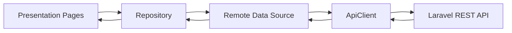

# Dokumentasi Flutter Kanzza Frozen Food

> **Nama aplikasi:** Kanzza Frozen Food Mobile
> **Framework:** Flutter
> **Bahasa:** Dart
> **State management:** Provider
> **Penyimpanan token:** Flutter Secure Storage
> **Backend:** Laravel REST API
> **Payment UI:** Midtrans Snap WebView
> **Base API produksi:** `https://kanza.djncloud.my.id/api/v1`
> **Repository:** `arhan321/kanzza_mobile`

---

## Daftar Isi

1. [Gambaran Umum](#1-gambaran-umum)
2. [Tujuan Aplikasi](#2-tujuan-aplikasi)
3. [Aktor dan Fitur](#3-aktor-dan-fitur)
4. [Teknologi dan Dependency](#4-teknologi-dan-dependency)
5. [Arsitektur Flutter](#5-arsitektur-flutter)
6. [Struktur Folder](#6-struktur-folder)
7. [Cara Kerja Layer](#7-cara-kerja-layer)
8. [Instalasi](#8-instalasi)
9. [Konfigurasi Base URL](#9-konfigurasi-base-url)
10. [Konfigurasi Android](#10-konfigurasi-android)
11. [Main dan Provider](#11-main-dan-provider)
12. [Routing](#12-routing)
13. [API Client](#13-api-client)
14. [Secure Storage](#14-secure-storage)
15. [Model dan Parsing JSON](#15-model-dan-parsing-json)
16. [Data Source](#16-data-source)
17. [Repository](#17-repository)
18. [Error Handling](#18-error-handling)
19. [Autentikasi](#19-autentikasi)
20. [Role Redirect](#20-role-redirect)
21. [Customer Module](#21-customer-module)
22. [Cashier Module](#22-cashier-module)
23. [Driver Module](#23-driver-module)
24. [Owner Module](#24-owner-module)
25. [Keranjang](#25-keranjang)
26. [Checkout dan Midtrans](#26-checkout-dan-midtrans)
27. [Theme](#27-theme)
28. [Format Harga dan Tanggal](#28-format-harga-dan-tanggal)
29. [Loading, Empty, dan Error State](#29-loading-empty-dan-error-state)
30. [Pengujian](#30-pengujian)
31. [Build dan Release](#31-build-dan-release)
32. [Troubleshooting](#32-troubleshooting)
33. [Keterbatasan](#33-keterbatasan)
34. [Checklist Final Flutter](#34-checklist-final-flutter)
35. [Panduan Pengembangan Lanjutan](#35-panduan-pengembangan-lanjutan)

---

# 1. Gambaran Umum

Kanzza Mobile merupakan aplikasi Flutter yang menjadi client untuk backend Laravel Kanzza Frozen Food. Aplikasi mendukung empat role:

- Customer.
- Cashier.
- Driver.
- Owner.

Aplikasi mengirim dan menerima data dalam format JSON melalui HTTPS. Token autentikasi disimpan menggunakan secure storage. UI berbeda berdasarkan role pengguna.



---

# 2. Tujuan Aplikasi

1. Menyediakan aplikasi mobile untuk seluruh role.
2. Mengurangi penggunaan data dummy.
3. Mengambil data langsung dari Laravel.
4. Menjaga tampilan tetap responsif.
5. Menyimpan token dengan aman.
6. Menangani error server.
7. Menjalankan alur customer sampai pembayaran.
8. Menjalankan transaksi kasir.
9. Menjalankan pengiriman driver.
10. Menampilkan dashboard owner.
11. Menjaga struktur layered architecture.

---

# 3. Aktor dan Fitur

## 3.1 Customer

- Register.
- Login.
- Melihat produk.
- Filter kategori.
- Mencari produk.
- Menambahkan produk ke cart.
- Mengubah quantity.
- Mengelola alamat.
- Checkout delivery/pickup.
- Membayar melalui Midtrans.
- Mengecek status pembayaran.
- Melihat pesanan.
- Membatalkan pesanan.
- Pesan lagi.
- Melihat profil.
- Logout.

## 3.2 Cashier

- Login.
- Melihat dashboard.
- Melihat produk.
- Membuat transaksi kasir.
- Menghitung pembayaran dan kembalian.
- Melihat riwayat transaksi.
- Memproses order.
- Menugaskan driver.
- Logout.

## 3.3 Driver

- Login.
- Melihat tugas delivery.
- Filter status.
- Melihat detail customer dan alamat.
- Mengubah status:
  - assigned.
  - picked_up.
  - on_delivery.
  - delivered.
- Memberi catatan.
- Logout.

## 3.4 Owner

Backend menyediakan:

- Dashboard owner.
- CRUD kategori.
- CRUD produk.
- User management.
- Status user.
- Role user.
- Order processing.
- Driver assignment.

Halaman Flutter owner perlu selalu diaudit bersama endpoint backend karena modul owner memiliki cakupan terbesar.

---

# 4. Teknologi dan Dependency

Contoh `pubspec.yaml`:

```yaml
name: kanzza_sales_app_fe
description: "Kanzza Frozen Food mobile application."
publish_to: none
version: 1.0.0+1

environment:
  sdk: ^3.11.5

dependencies:
  flutter:
    sdk: flutter

  cupertino_icons: ^1.0.8
  google_fonts: ^8.1.0

  http: ^1.6.0
  provider: ^6.1.1
  flutter_secure_storage: ^10.3.1
  webview_flutter: ^4.14.0

  intl: ^0.19.0
  url_launcher: ^6.3.2
  fl_chart: ^0.68.0

  flutter_map: ^8.3.0
  latlong2: ^0.9.1
  geolocator: ^14.0.2
  geocoding: ^4.0.0
  location: ^5.0.0
  permission_handler: ^11.0.1
  path_provider: ^2.1.2
```

## 4.1 Fungsi Dependency

| Dependency | Fungsi |
|---|---|
| `http` | Request REST API |
| `provider` | State management |
| `flutter_secure_storage` | Token dan cart storage |
| `webview_flutter` | Midtrans Snap |
| `intl` | Format tanggal |
| `google_fonts` | Font UI |
| `url_launcher` | Membuka URL/telepon/map bila dibutuhkan |
| `fl_chart` | Chart owner |
| `flutter_map` | Peta |
| `geolocator` | Lokasi perangkat |
| `geocoding` | Konversi koordinat/alamat |
| `permission_handler` | Permission runtime |
| `path_provider` | Path file lokal |

Dependency map/lokasi tidak boleh dihapus sebelum memastikan tidak ada file yang menggunakannya.

---

# 5. Arsitektur Flutter

Aplikasi menggunakan layered architecture ringan.

```text
Presentation
    ↓
Repository
    ↓
Remote Data Source
    ↓
ApiClient
    ↓
Laravel API
```

Provider digunakan untuk state yang perlu diakses lintas halaman, terutama:

- Theme.
- Customer cart.

Sebagian logika halaman tetap berada pada presentation sesuai keputusan project, tetapi akses data tidak dilakukan langsung menggunakan `http` dari setiap widget. Request diarahkan melalui repository dan data source.

---

# 6. Struktur Folder

```text
lib/
├── core/
│   ├── config/
│   │   └── app_config.dart
│   ├── constants/
│   │   └── api_endpoints.dart
│   ├── errors/
│   │   └── api_exception.dart
│   ├── network/
│   │   ├── api_client.dart
│   │   └── api_response.dart
│   ├── storage/
│   │   └── auth_storage.dart
│   ├── theme/
│   └── widgets/
│
├── data/
│   ├── datasources/
│   │   ├── auth_remote_data_source.dart
│   │   ├── product_remote_datasource.dart
│   │   ├── address_remote_datasource.dart
│   │   ├── customer_order_remote_datasource.dart
│   │   ├── cashier_transaction_remote_datasource.dart
│   │   └── driver_delivery_remote_datasource.dart
│   │
│   ├── models/
│   │   ├── user.dart
│   │   ├── category.dart
│   │   ├── product.dart
│   │   ├── cart_item.dart
│   │   ├── address.dart
│   │   ├── customer_order.dart
│   │   ├── cashier_transaction.dart
│   │   └── driver_delivery.dart
│   │
│   └── repositories/
│       ├── user_repository.dart
│       ├── product_repository.dart
│       ├── cart_repository.dart
│       ├── address_repository.dart
│       ├── customer_order_repository.dart
│       ├── cashier_transaction_repository.dart
│       └── driver_delivery_repository.dart
│
├── presentation/
│   ├── pages/
│   │   ├── auth/
│   │   ├── cashier/
│   │   ├── customer/
│   │   ├── driver/
│   │   └── owner/
│   └── providers/
│       └── customer_cart_provider.dart
│
├── main.dart
└── routes.dart
```

---

# 7. Cara Kerja Layer

## 7.1 Core

Menyimpan kode umum:

- Konfigurasi base URL.
- Endpoint.
- HTTP client.
- Error class.
- Secure storage.
- Theme.
- Reusable widget.

## 7.2 Data

Menyimpan:

- Model JSON.
- Remote data source.
- Repository.

## 7.3 Presentation

Menyimpan:

- StatefulWidget/StatelessWidget.
- Controller form.
- Loading state.
- Error state.
- Navigation.
- Dialog.
- Bottom sheet.
- UI per role.

---

# 8. Instalasi

## 8.1 Clone

```bash
git clone https://github.com/arhan321/kanzza_mobile.git
cd kanzza_mobile
```

## 8.2 Cek Flutter

```bash
flutter doctor -v
```

## 8.3 Install Dependency

```bash
flutter pub get
```

## 8.4 Analisis

```bash
flutter analyze
```

## 8.5 Jalankan

```bash
flutter run
```

## 8.6 Reset Build

```bash
flutter clean
flutter pub get
flutter run
```

---

# 9. Konfigurasi Base URL

File:

```text
lib/core/config/app_config.dart
```

Contoh:

```dart
class AppConfig {
  static const String baseUrl =
      'https://kanza.djncloud.my.id/api/v1';
}
```

Aturan:

- Jangan menambahkan slash di akhir jika endpoint sudah diawali slash.
- Gunakan HTTPS untuk production.
- Jangan hardcode URL di setiap page.
- Semua request memakai satu sumber base URL.

Local emulator Android:

```text
http://10.0.2.2:8000/api/v1
```

Physical device:

```text
http://IP_LAPTOP:8000/api/v1
```

Server production:

```text
https://kanza.djncloud.my.id/api/v1
```

---

# 10. Konfigurasi Android

## 10.1 Internet Permission

File:

```text
android/app/src/main/AndroidManifest.xml
```

Tambahkan sebelum `<application>`:

```xml
<uses-permission
    android:name="android.permission.INTERNET" />
```

## 10.2 Lokasi

Bila fitur lokasi digunakan:

```xml
<uses-permission
    android:name="android.permission.ACCESS_FINE_LOCATION" />

<uses-permission
    android:name="android.permission.ACCESS_COARSE_LOCATION" />
```

## 10.3 Kamera

Bila bukti foto ditambahkan:

```xml
<uses-permission
    android:name="android.permission.CAMERA" />
```

## 10.4 HTTP Lokal

Production menggunakan HTTPS. Jika local masih HTTP, tambahkan hanya untuk development:

```xml
<application
    android:usesCleartextTraffic="true">
```

Jangan mengaktifkan cleartext tanpa kebutuhan.

## 10.5 Developer Mode Windows

Error:

```text
Building with plugins requires symlink support
```

Buka:

```powershell
start ms-settings:developers
```

Aktifkan Developer Mode, restart VS Code, lalu:

```powershell
flutter clean
flutter pub get
flutter run
```

---

# 11. Main dan Provider

Contoh `main.dart`:

```dart
void main() {
  WidgetsFlutterBinding.ensureInitialized();
  runApp(const MyApp());
}
```

Provider:

```dart
MultiProvider(
  providers: [
    ChangeNotifierProvider(
      create: (_) => ThemeProvider(),
    ),
    ChangeNotifierProvider(
      create: (_) =>
          CustomerCartProvider()..initialize(),
    ),
  ],
)
```

## 11.1 ThemeProvider

Menentukan light/dark mode.

## 11.2 CustomerCartProvider

Menyimpan state cart global:

- Item.
- Total item.
- Total harga.
- Tambah produk.
- Update quantity.
- Hapus produk.
- Clear cart.
- Sinkronisasi harga dan stok.

---

# 12. Routing

File:

```text
lib/routes.dart
```

Route utama:

```text
/login
/register
/customer-home
/cashier-dashboard
/cashier-products
/offline-transaction
/transaction-history
/driver-dashboard
/owner-dashboard
```

Sebagian halaman detail dibuka memakai `MaterialPageRoute` agar object model dapat langsung dikirim.

---

# 13. API Client

File:

```text
lib/core/network/api_client.dart
```

Tanggung jawab:

- Menggabungkan base URL dan endpoint.
- Menambahkan header JSON.
- Menambahkan Bearer token.
- Encode body.
- Decode response.
- Mengubah error HTTP menjadi `ApiException`.
- Menangani timeout/network error.

Header:

```dart
{
  'Accept': 'application/json',
  'Content-Type': 'application/json',
  if (token != null)
    'Authorization': 'Bearer $token',
}
```

Metode:

```text
GET
POST
PUT
PATCH
DELETE
```

Upload produk multipart membutuhkan metode multipart khusus.

---

# 14. Secure Storage

Token disimpan menggunakan:

```text
flutter_secure_storage
```

Data yang disimpan:

- Token.
- User JSON.
- Cart per user.

Jangan gunakan plain SharedPreferences untuk token sensitif.

Contoh key:

```text
auth_token
auth_user
kanzza_customer_cart_1
```

Cart memakai ID user agar cart antar akun tidak tercampur.

---

# 15. Model dan Parsing JSON

Model bertugas mengubah Map menjadi object Dart.

Contoh:

```dart
factory ProductModel.fromJson(
  Map<String, dynamic> json,
) {
  return ProductModel(
    id: parseInt(json['id']),
    name: json['name']?.toString() ?? '',
    sellingPrice:
        parseInt(json['selling_price']),
  );
}
```

Model perlu tahan terhadap:

- `int`.
- `double`.
- String angka.
- Null.
- Boolean 0/1.
- Tanggal null.

Hindari casting langsung:

```dart
json['selling_price'] as int
```

karena API dapat mengirim `"15000"`.

---

# 16. Data Source

Remote data source hanya menangani request endpoint.

Contoh:

```dart
Future<ApiResponse> getProducts() {
  return _apiClient.get(
    ApiEndpoints.products,
  );
}
```

Data source tidak mengelola widget.

---

# 17. Repository

Repository:

- Memanggil data source.
- Mengubah JSON menjadi model.
- Menyortir data.
- Memberi error yang lebih jelas.
- Menjadi penghubung page dengan API.

Contoh:

```dart
final products =
    await ProductRepository().getProducts();
```

Page tidak perlu mengetahui detail parsing JSON.

---

# 18. Error Handling

## 18.1 ApiException

Informasi:

- Message.
- Status code.
- Validation errors.
- Unauthorized status.
- Forbidden status.

## 18.2 Validation Error

Ambil error pertama:

```dart
error.firstValidationError
```

## 18.3 Unauthorized

Saat 401:

```text
hapus local session
→ pushNamedAndRemoveUntil login
```

## 18.4 Forbidden

Tampilkan:

```text
Anda tidak memiliki akses.
```

## 18.5 Network Error

Tampilkan retry state, bukan crash.

---

# 19. Autentikasi

## 19.1 Splash

Splash memeriksa:

1. Token ada atau tidak.
2. User cached ada atau tidak.
3. Request `/auth/me`.
4. Role user.
5. Redirect.

## 19.2 Login

Request:

```json
{
  "email": "driver@kanzza.com",
  "password": "123456",
  "device_name": "Flutter Android"
}
```

Setelah berhasil:

- Token disimpan.
- User disimpan.
- Role redirect.

## 19.3 Register

Register hanya membuat customer.

## 19.4 Logout

```text
POST /auth/logout
→ clear secure storage
→ login
```

Walaupun request logout gagal karena jaringan, sesi lokal sebaiknya tetap dihapus agar user dapat keluar dari aplikasi.

---

# 20. Role Redirect

```dart
switch (user.role) {
  case 'customer':
    route = AppRoutes.customerHome;
    break;
  case 'cashier':
    route = AppRoutes.cashierDashboard;
    break;
  case 'driver':
    route = AppRoutes.driverDashboard;
    break;
  case 'owner':
    route = AppRoutes.ownerDashboard;
    break;
}
```

Role dari backend adalah sumber kebenaran.

---

# 21. Customer Module

## 21.1 Customer Home

File:

```text
customer_home_page.dart
```

Endpoint:

```text
GET /categories
GET /products
```

Fitur:

- Kategori Laravel.
- Produk Laravel.
- Search nama/SKU/kategori.
- Filter kategori.
- Status stok.
- Detail produk.
- Tambah cart.
- Refresh.
- Sinkronisasi cart.

## 21.2 Customer Cart

File:

```text
customer_cart_page.dart
```

Sumber:

- Cart lokal.
- Produk terbaru dari Laravel untuk sinkronisasi.

Validasi:

- Produk aktif.
- Stok tersedia.
- Quantity tidak melebihi stok.
- Checkout tidak boleh jika invalid.

## 21.3 Customer Checkout

File:

```text
customer_checkout_page.dart
```

Endpoint:

```text
GET /auth/me
GET /addresses
POST /addresses
POST /orders
POST /orders/{id}/payment
POST /orders/{id}/payment/check
```

Fitur:

- Delivery/pickup.
- Pilih alamat.
- Tambah alamat.
- Catatan.
- Ringkasan.
- Create order.
- Midtrans.

## 21.4 Customer Orders

File:

```text
customer_orders_page.dart
```

Endpoint:

```text
GET /orders
GET /orders/{id}
POST /orders/{id}/cancel
POST /orders/{id}/payment
POST /orders/{id}/payment/check
```

Fitur:

- Status.
- Filter tanggal.
- Detail.
- Lanjut pembayaran.
- Cek pembayaran.
- Batalkan.
- Pesan lagi.

## 21.5 Customer Profile

File:

```text
customer_profile_page.dart
customer_addresses_page.dart
```

Endpoint:

```text
GET /auth/me
POST /auth/logout
GET /addresses
POST /addresses
PATCH /addresses/{id}
DELETE /addresses/{id}
```

Edit profil dan password belum aktif karena backend belum menyediakan endpoint.

---

# 22. Cashier Module

## 22.1 Cashier Dashboard

Menampilkan:

- Ringkasan transaksi.
- Akses produk.
- Transaksi baru.
- Riwayat.
- Pesanan online bila tersedia.

Data harus berasal dari repository, bukan dummy.

## 22.2 Product Catalog Cashier

Endpoint:

```text
GET /categories
GET /products
```

Cashier hanya melihat produk, bukan mengubah data owner.

## 22.3 Offline Transaction

Endpoint:

```text
POST /cashier/transactions
```

Payload:

```json
{
  "customer_id": null,
  "items": [
    {
      "product_id": 1,
      "quantity": 2
    }
  ],
  "payment_amount": 100000,
  "notes": "Pembelian di toko"
}
```

Flutter menampilkan estimasi, tetapi backend memvalidasi total final.

## 22.4 Transaction History

Endpoint:

```text
GET /cashier/transactions
```

Fitur:

- Search.
- Filter tanggal.
- Statistik.
- Detail produk.
- Total.
- Uang diterima.
- Kembalian.
- Refresh.

---

# 23. Driver Module

## 23.1 Driver Dashboard

File:

```text
driver_dashboard_page.dart
```

Endpoint:

```text
GET /auth/me
GET /driver/deliveries
GET /driver/deliveries/{id}
PATCH /driver/deliveries/{id}/status
POST /auth/logout
```

## 23.2 Status Delivery

```text
assigned
→ picked_up
→ on_delivery
→ delivered
```

Tombol:

| Status | Tombol |
|---|---|
| assigned | Ambil Pesanan |
| picked_up | Mulai Pengiriman |
| on_delivery | Selesaikan Pengiriman |
| delivered | Tidak ada |

## 23.3 Detail Driver

Menampilkan:

- Nomor order.
- Customer.
- Telepon.
- Alamat.
- Koordinat bila tersedia.
- Produk.
- Total.
- Payment status.
- Catatan.
- Timeline.

## 23.4 Data yang Tidak Ditampilkan Dummy

Backend belum menyediakan:

- Jarak.
- ETA.
- Tracking realtime.

Karena itu aplikasi tidak boleh menampilkan angka jarak/estimasi buatan.

## 23.5 Proof Image

Backend belum memiliki upload multipart proof. Flutter belum mengirim path lokal sebagai bukti.

---

# 24. Owner Module

Endpoint backend:

```text
GET /owner/dashboard
POST /owner/categories
PUT/PATCH /owner/categories/{id}
DELETE /owner/categories/{id}

POST /owner/products
POST/PUT/PATCH /owner/products/{id}
DELETE /owner/products/{id}

GET /owner/users
POST /owner/users
PATCH /owner/users/{id}/role
PATCH /owner/users/{id}/status
```

Owner page perlu mencakup:

- Dashboard data API.
- Product management multipart.
- Category management.
- User management.
- Role/status management.
- Low stock.
- Reports.

Setiap halaman owner yang masih memakai dummy harus diganti memakai repository.

---

# 25. Keranjang

Backend belum menyediakan cart endpoint. Cart disimpan lokal.

## 25.1 Alur

```text
CustomerHome
→ CustomerCartProvider
→ CartRepository
→ Secure Storage
→ CustomerCartPage
```

## 25.2 Sinkronisasi

Saat home/cart dibuka:

1. Ambil produk Laravel.
2. Cocokkan product ID.
3. Perbarui nama.
4. Perbarui harga.
5. Perbarui stok.
6. Perbarui status aktif.
7. Kurangi quantity jika melebihi stok.
8. Tandai invalid jika produk hilang/nonaktif.

## 25.3 Setelah Order Berhasil

Checkout mengembalikan `true`.

Cart page:

```dart
if (result == true) {
  await cartProvider.clear();
}
```

---

# 26. Checkout dan Midtrans

## 26.1 Create Order

Flutter tidak mengirim harga.

```json
{
  "delivery_method": "delivery",
  "address_id": 1,
  "items": [
    {
      "product_id": 1,
      "quantity": 2
    }
  ],
  "notes": "Hubungi sebelum mengantar"
}
```

## 26.2 Create Payment

```text
POST /orders/{id}/payment
```

Flutter menerima:

- Snap token.
- Redirect URL.
- Payment ID.
- Status.

## 26.3 WebView

File:

```text
midtrans_payment_page.dart
```

JavaScript diaktifkan karena Midtrans Snap membutuhkannya.

## 26.4 Setelah WebView

Flutter tidak menganggap pembayaran berhasil hanya karena WebView ditutup.

Flutter memanggil:

```text
POST /orders/{id}/payment/check
```

## 26.5 Tombol Check Again

Dialog menyediakan cek status ulang.

## 26.6 No Server Key

Flutter dilarang menyimpan Server Key.

---

# 27. Theme

ThemeProvider mengelola:

- Light theme.
- Dark theme.
- Theme mode.

Widget menggunakan:

```dart
final isDark =
    context.watch<ThemeProvider>().isDarkMode;
```

Gunakan `Theme.of(context)` untuk warna teks agar konsisten.

---

# 28. Format Harga dan Tanggal

## 28.1 Rupiah

```dart
String formatPrice(int price) {
  return price.toString().replaceAllMapped(
    RegExp(r'(\d{1,3})(?=(\d{3})+(?!\d))'),
    (match) => '${match[1]}.',
  );
}
```

## 28.2 Tanggal

```dart
DateFormat('dd/MM/yyyy HH:mm')
```

Pastikan date API dikonversi ke local:

```dart
date.toLocal()
```

---

# 29. Loading, Empty, dan Error State

Setiap halaman API minimal memiliki:

- Initial loading.
- Refresh loading.
- Empty state.
- Error state.
- Retry.
- Processing per item.
- Unauthorized handling.

Contoh state:

```dart
bool _isLoading = true;
bool _isRefreshing = false;
int? _processingId;
String? _errorMessage;
```

Jangan menampilkan spinner penuh saat refresh jika data lama masih tersedia.

---

# 30. Pengujian

## 30.1 Static Analysis

```bash
flutter analyze
```

## 30.2 Unit Test

```bash
flutter test
```

## 30.3 Manual Test Authentication

- Login customer.
- Login cashier.
- Login driver.
- Login owner.
- Salah password.
- User inactive.
- Logout.
- Token invalid.

## 30.4 Customer E2E

```text
Login
→ Home
→ Add cart
→ Cart
→ Address
→ Checkout
→ Midtrans
→ Check status
→ Orders
→ Detail
```

## 30.5 Cashier E2E

```text
Login
→ Product catalog
→ Add items
→ Input payment
→ Create transaction
→ History
→ Detail
```

## 30.6 Driver E2E

```text
Login
→ Delivery assigned
→ Detail
→ Picked up
→ On delivery
→ Delivered
→ Refresh
```

## 30.7 Owner E2E

```text
Login
→ Dashboard
→ Create category
→ Create product
→ Update stock
→ Create driver
→ Assign order
```

---

# 31. Build dan Release

## 31.1 Debug APK

```bash
flutter build apk --debug
```

## 31.2 Release APK

```bash
flutter build apk --release
```

Output:

```text
build/app/outputs/flutter-apk/app-release.apk
```

## 31.3 App Bundle

```bash
flutter build appbundle --release
```

Output:

```text
build/app/outputs/bundle/release/app-release.aab
```

## 31.4 Version

```yaml
version: 1.0.0+1
```

Contoh update:

```yaml
version: 1.0.1+2
```

## 31.5 Release Checklist

- Base URL production.
- HTTPS.
- Debug banner off.
- Keystore benar.
- Internet permission.
- `flutter analyze` bersih.
- Test seluruh role.
- Midtrans mode benar.
- No secret pada source.

---

# 32. Troubleshooting

## 32.1 ProviderNotFoundException

Pastikan provider didaftarkan di atas MaterialApp.

## 32.2 401

- Token tidak tersimpan.
- Header tidak dikirim.
- Token logout.
- Endpoint membutuhkan auth.

## 32.3 403

Role tidak sesuai. Ini bukan error UI jika endpoint memang dibatasi.

## 32.4 SocketException

- Internet tidak tersedia.
- Domain salah.
- Server mati.
- SSL bermasalah.
- Android internet permission belum ada.

## 32.5 HandshakeException

Periksa sertifikat HTTPS domain.

## 32.6 FormatException JSON

Backend mengirim HTML/error page. Periksa status dan body mentah.

## 32.7 Image Network Tidak Tampil

- URL image tidak lengkap.
- APP_URL backend salah.
- Storage link belum dibuat.
- File hilang.
- HTTPS mixed content.

## 32.8 WebView Tidak Tampil

- `webview_flutter` belum terpasang.
- Internet permission.
- Redirect URL kosong.
- Plugin belum ter-build.
- Developer Mode Windows belum aktif.

## 32.9 Symlink Support

```powershell
start ms-settings:developers
```

## 32.10 Android Build Lama

```bash
flutter clean
flutter pub get
cd android
gradlew clean
cd ..
flutter run
```

## 32.11 Dependency Conflict

```bash
flutter pub outdated
flutter pub get
```

Jangan update seluruh dependency tanpa pengujian.

## 32.12 Git Askpass Error

Error askpass bukan error Flutter. Jalankan push dari terminal biasa atau perbaiki credential manager.

---

# 33. Keterbatasan

1. Cart belum disimpan server.
2. Payment tidak memakai webhook.
3. Proof delivery belum upload multipart.
4. Edit profil belum tersedia.
5. Ubah password belum tersedia.
6. Tracking driver realtime belum tersedia.
7. Push notification belum tersedia.
8. ETA/jarak belum berasal dari backend.
9. Owner module perlu final audit menyeluruh.
10. Automated widget/integration test masih perlu ditambah.
11. Flutter analyze final harus dijalankan pada mesin developer.

---

# 34. Checklist Final Flutter

## Core

- [ ] Base URL benar.
- [ ] Endpoint benar.
- [ ] ApiClient mengirim Bearer token.
- [ ] ApiException menangani validation.
- [ ] Secure storage bekerja.

## Authentication

- [ ] Register.
- [ ] Login.
- [ ] Splash.
- [ ] Auth me.
- [ ] Role redirect.
- [ ] Logout.
- [ ] Unauthorized redirect.

## Customer

- [ ] Produk Laravel tampil.
- [ ] Kategori tampil.
- [ ] Search.
- [ ] Cart tersimpan.
- [ ] Stock sync.
- [ ] Address CRUD.
- [ ] Checkout.
- [ ] Midtrans.
- [ ] Payment check.
- [ ] Orders.
- [ ] Cancel.
- [ ] Reorder.
- [ ] Profile.

## Cashier

- [ ] Dashboard.
- [ ] Product.
- [ ] Transaction.
- [ ] Payment amount.
- [ ] Change amount.
- [ ] History.
- [ ] Order processing.
- [ ] Driver assignment.

## Driver

- [ ] Delivery list.
- [ ] Detail.
- [ ] Picked up.
- [ ] On delivery.
- [ ] Delivered.
- [ ] Refresh.
- [ ] Logout.

## Owner

- [ ] Dashboard.
- [ ] Category CRUD.
- [ ] Product CRUD.
- [ ] Image upload.
- [ ] Stock.
- [ ] User management.
- [ ] Role.
- [ ] User status.

## Build

- [ ] Developer Mode aktif.
- [ ] `flutter pub get`.
- [ ] `flutter analyze`.
- [ ] `flutter test`.
- [ ] APK release.
- [ ] AAB release.

---

# 35. Panduan Pengembangan Lanjutan

## 35.1 Menambah Modul API Baru

Urutan:

```text
Model
→ RemoteDataSource
→ Repository
→ Page/Provider
→ Route
→ Test
```

## 35.2 Penamaan

File:

```text
snake_case.dart
```

Class:

```text
PascalCase
```

Variable/function:

```text
camelCase
```

## 35.3 Jangan Lakukan

- Request `http` langsung dari banyak widget.
- Hardcode token.
- Hardcode harga.
- Hardcode role.
- Simpan Midtrans Server Key.
- Menampilkan success palsu.
- Mengubah status hanya lokal.
- Menampilkan dummy setelah integrasi backend.

## 35.4 Commit

```text
feat(customer): integrate order history API
feat(driver): add delivery status update
fix(auth): clear session on unauthorized
refactor(api): centralize endpoint constants
docs(flutter): add setup guide
```

## 35.5 Prioritas Pengembangan

1. Final audit owner.
2. Upload proof delivery.
3. Profile update.
4. Password update.
5. Midtrans webhook support.
6. Push notification.
7. Driver navigation.
8. Integration tests.
9. Offline strategy.
10. Crash reporting.

---

# Penutup

Flutter Kanzza berfungsi sebagai antarmuka untuk backend Laravel. Seluruh data bisnis utama harus mengikuti response backend. UI boleh menghitung estimasi untuk tampilan, tetapi backend tetap menjadi sumber kebenaran untuk harga, stok, total, status pembayaran, role, order, dan delivery.

Dokumen ini harus diperbarui setiap kali struktur folder, dependency, endpoint, flow pembayaran, atau halaman role berubah.
